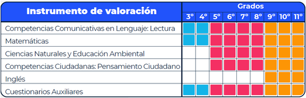

# Análisis de los resultados de Evaluar para Avanzar 2022-1 para los estudiantes de instituciones educativas de los departamentos de la Amazonía colombiana.

**Contenido**  
- [Contexto](#Contexto)
  - [Problema](#Problema)
- [Definición del proyecto de analítica](#Definicion)
  - [Pregunta de negocio y alcance del proyecto](#Pregunta)
  - [Objetivo del proyecto](#Objetivo)
  - [Alcance del proyecto](#Alcance)
  - [Resultados esperados](#Resultados)
  - [Seguimiento a las actividades del proyecto](#Seguimiento)
- [¿Cómo está estructurado este repositorio?](#Estructura)

## Contexto
En Colombia, el Instituto Colombiano para la Evaluación de la Educación ICFES, es la entidad encargada de evaluar a nivel nacional las habilidades y competencias de los estudiantes en los distintos niveles escolares, desde grado 3° hasta la formación profesional. Para cumplir con este propósito, el ICFES diseña y aplica un conjunto de exámenes estandarizados conocidos como Pruebas Saber (Saber 3°, 5°, 7° y 9°, Saber 11°, Saber TyT y Saber Pro).

Sin embargo, en los últimos años, el ICFES ha desarrollado una estrategia complementaria a las Pruebas Saber conocida como Evaluar para Avanzar. Este instrumento se diferencia de las anteriores por su intencionalidad diagnóstica-formativa, en la que los docentes de las instituciones educativas que apliquen de forma voluntaria esta estrategia son los principales beneficiados al obtener un diagnóstico del desarrollo de las habilidades y conocimientos de sus estudiantes, lo que le permite identificar las fortalezas y las dificultades de cada uno de ellos.

La implementación de Evaluar para Avanzar se realiza entre los grados 3° y 11°. En estos grados se aplican instrumentos de valoración asociados a las áreas básicas de conocimiento. La siguiente figura muestra la distribución de los instrumentos a lo largo de los grados.

### Problema
En este sentido, el problema considerado consiste en analizar los resultados de los distintos instrumentos de los estudiantes de las instituciones educativas de los departamentos que componen la Amazonía colombiana (Guainía, Vaupés, Vichada, Guaviare y Amazonas ) que aplicaron la estrategia de Evaluar para Avanzar en el 2022-1 e intentar predecir los resultados de la prueba de Lectura a partir de una caracterización del estudiante, considerando que en algunas instituciones no siempre hay disponibilidad de tiempo y recursos para aplicar todos los instrumentos a todos los estudiantes.

## Definición del proyecto de analítica
### Pregunta de negocio y alcance del proyecto

La pregunta de negocio busca desarrollar una herramienta analítica que presente los resultados del instrumento de Lectura aplicado durante el 2022-1 de los estudiantes de las instituciones educativas de los departamentos de Amazonas, Guainía, Guaviare, Vaupés y Vichada, así como un modelo predictivo sobre el resultado de este instrumento a partir de características del estudiante, de su establecimiento educativo y los resultados en los demás instrumentos. Se busca así responder a la pregunta:

¿Cuál sería el puntaje en Lectura de un estudiante de alguno de estos 5 departamentos a partir de variables como el género, el grado, la jornada, el municipio y los resultados obtenidos en los otros instrumentos?

### Objetivo del proyecto

El presente proyecto tiene como objetivo analizar los resultados de los estudiantes en la prueba de Lectura de las instituciones educativas colombianas que participaron en la estrategia de Evaluar para Avanzar durante el 2022-1 y utilizarlos junto con otras variables para intentar predecir el resultado en el instrumento de Lectura de estudiantes nuevos o estudiantes que no lograron presentarlo.

### Alcance del proyecto

El análisis descrito previamente busca:

- Conocer los resultados de los estudiantes de los establecimientos educativos de 5 departamentos que son parte de la Amazonía colombiana que aplicaron la estrategia de Evaluar para Avanzar durante el 2022-1.

- Desarrollar un modelo predictivo para el resultado del instrumento de Lectura a partir de variables relacionadas con la naturaleza del establecimiento educativo y con el estudiante y sus resultados en los otros instrumentos.

### Resultados esperados

Como resultado principal del proyecto, se busca obtener un tablero de control que permita visualizar los resultados de los estudiantes de las instituciones educativas, así como una predicción sobre el resultado de este instrumento de Lectura a partir de variables asociadas al estudiante y su establecimiento educativo.

### Seguimiento a las actividades del proyecto
Accede a la programación de actividades por cada iteración semanal a través de: https://github.com/users/dayroncj/projects/4/views/4

## ¿Cómo está estructurado este repositorio?

Este repositorio nace de la necesidad de aplicar los conceptos y buenas prácticas aprendidas en el curso de Despliegue de soluciones analíticas de la Maestría de inteligencia analítica de datos de la Universidad de Los Andes basado en las etápas de la metodología CRISP-ML (Cross-Industry Standard Process for Machine Learning).

A continuación, se describe la estructura de directorios que reflejan las diferentes etapas en la metodología, esto con el objetivo de facilitar a los colaboradores el mantenimiento del repositorio y a usuarios e interesados navegar por el contenido:

- **docs/**  
  Directorio para la documentación del proyecto. 
   - CRISP-ML.md: Describe cómo se aplicará la metodología CRISP-ML en el proyecto.
   - Data_Dictionary.md: Describe las variables y características de los datos utilizados en el proyecto.

- **data/**  
  Directorio para almacenar los datos brutos y procesados.
   - raw/: Datos en bruto sin procesar.
   - processed/: Datos procesados y limpios, que pueden incluir subdirectorios para diferentes etapas de procesamiento.

- **src/**  
  Directorio para el código fuente del proyecto.
   - data_preparation/: Scripts y notebooks relacionados con la preparación de datos y análisis exploratorio de los mismos.
   - modeling/: Scripts y notebooks relacionados con la construcción de modelos.
   - evaluation/: Scripts y notebooks relacionados con la evaluación de modelos.
   - deployment/: Scripts y notebooks relacionados con la implementación de modelos.
   - utils/: Código de utilidades y funciones compartidas.
   - visualizations/: Componentes visuales de apoyo para análisis descriptivo.

- **results/**
  Directorio para almacenar los resultados intermedios y finales del proyecto.
   - models/: Modelos entrenados y sus artefactos relacionados.
   - reports/: Informes y visualizaciones generadas a lo largo del proyecto.

- **deliverables/**  
  Directorio para los entregables finales del proyecto.
   - presentations/: Presentaciones o informes finales.
   - final_model/: Archivos relacionados con el modelo final seleccionado.
