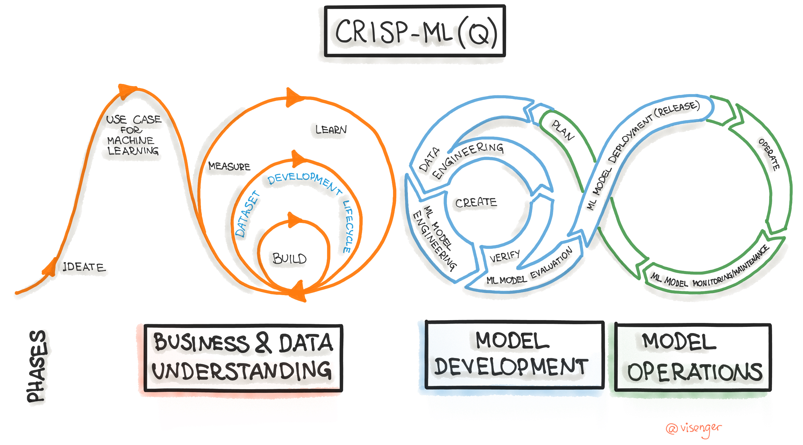

# Proyecto de Ciencia de Datos siguiendo la Metodología CRISP-ML

## Introducción
El objetivo de este documento es describir cómo se aplicará la metodología CRISP-ML (Cross-Industry Standard Process for Machine Learning) en nuestro proyecto de ciencia de datos. CRISP-ML proporciona una estructura sólida para guiar el proceso de minería de datos en diferentes etapas.

*Fases de la metodología CRISP-ML.  Fuente: Ml-ops.org*

## Fase 1: Comprensión del Negocio
En esta fase, nos centraremos en comprender los objetivos del negocio y definir el problema que queremos abordar con nuestro proyecto. Las actividades clave incluirán:
- Reuniones con los interesados para definir los objetivos del proyecto y los requisitos.
- Identificación de los indicadores clave de rendimiento (KPIs) relevantes para el negocio.
- Definición de la pregunta de negocio que queremos responder.

## Fase 2: Comprensión de los Datos
Esta fase se centra en recopilar, explorar y comprender los datos disponibles. Las actividades clave incluirán:
- Recopilación de datos brutos y acceso a fuentes de datos relevantes.
- Exploración inicial de datos para comprender su calidad y distribución.
- Identificación de patrones, relaciones y posibles problemas en los datos.

## Fase 3: Preparación de los Datos
En esta etapa, nos ocuparemos de limpiar, transformar y preparar los datos para su posterior análisis. Las actividades clave incluirán:
- Limpieza de datos para abordar valores faltantes y valores atípicos.
- Transformación de datos para crear características relevantes.
- Integración de datos si es necesario.

## Fase 4: Modelado
Esta fase se centra en la construcción de modelos de machine learning o análisis estadístico. Las actividades clave incluirán:
- Selección de algoritmos y técnicas de modelado adecuados.
- Entrenamiento y ajuste de modelos.
- Evaluación de modelos utilizando métricas apropiadas.

## Fase 5: Evaluación
En esta etapa, evaluaremos el rendimiento de nuestros modelos y aseguraremos que cumplan con los objetivos del negocio. Las actividades clave incluirán:
- Evaluación de modelos en función de métricas de rendimiento predefinidas.
- Validación cruzada y pruebas en conjuntos de datos separados.
- Ajuste de modelos si es necesario.

## Fase 6: Despliegue
En esta fase, implementaremos los modelos o resultados en el entorno de producción, lo que permitirá su uso en la toma de decisiones empresariales. Las actividades clave incluirán:
- Despliegue de modelos en un entorno de producción.
- Integración de modelos en sistemas y flujos de trabajo existentes.
- Monitoreo continuo del rendimiento de los modelos en producción.

